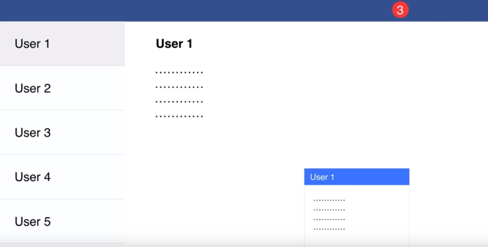
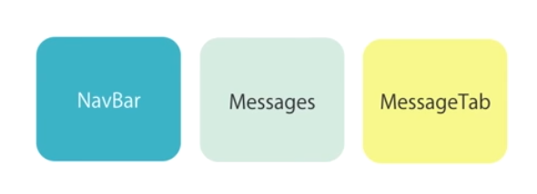
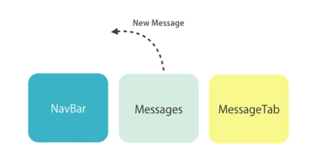
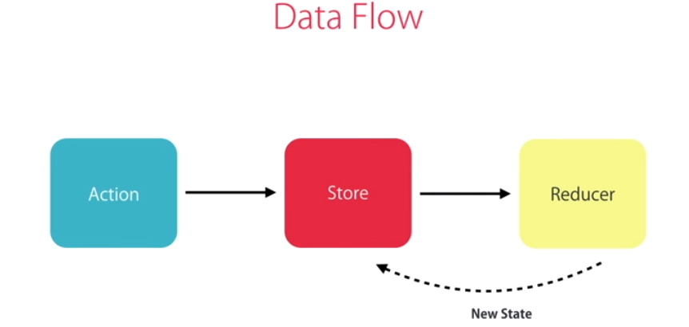

# Introduction to Redux for Angular2

## 背景
比如说一个应用三个视图(相互独立，不存在父子关系，需要同步)，
1. 一个是在导航栏用来展示当前用户的消息
2. 消息列表页面，
3. 以及底部的聊天框



如何保持3个组件的状态同步呢， 
1. 常规的方法是使用事件，但会是我们的应用变得复杂难以维护， 基于事件的方式难以维护和调试， 状态不可预知




## Redux是什么
> Redux is a **predictable** state container for JavaScript apps. Redux 是 JavaScript 状态容器，提供可预测化的状态管理。

## 优点
* Predictable application state 可预测化的应用状态
* Decoupled architecture（decouples your application from a presentation framework like angualr, so you can implement a big  chunk of your applicaiton and its and its presentation logic using simple functions that are completely decoupled from angular or any any presentation framework and then you can decide if you want to use angualr or maybe you want to use react）
* 纯函数，易于测试
* 好的工具，比如redux-devtool(chrome) 检测状态的变化
* 实现undo/redo的功能


## Reducer、Action、Store

### Store
> A single JS object that contains the state of the applicaiton. (可以认为是本地的数据库)
> Store 就是保存数据的地方，你可以把它看成一个容器。**整个应用只能有一个 Store。**

数据结构，就是我们实际存储的数据
```json
{
    message: [],       // 消息列表中的数据
    newMessages: 5,    // 导航栏的新消息的数据
    chatSoundsEnabled: true  // 是否允许消息提示
}

so on different views and components use different parts or different slices of the application state depending on their 
functionality and this also means if different components need to work with the same slice there is only one copy of that slice 
throughout the application so once a component modifies that slide the changes are immediately visible to other components we 
don't have multiple independent copies


```

### Action
> Plain JS objects that represent something that has happened.


### State
> Store对象包含所有数据。如果想得到某个时点的数据，就要对 Store 生成快照。这种时点的数据集合，就叫做 State。当前时刻的 State，可以通过store.getState()拿到。
惟一改变 state 的方法就是触发 action，action 是一个用于描述已发生事件的普通对象。

```json
{ type: 'MARK_AS_READ' }

{ type: 'POST_MESSAGE', body: '...' }

```

### dispatch
> View 发出 Action 的唯一方法。

1. 用户发出 Action。
2. Store 自动调用 Reducer，并且传入两个参数：当前 State 和收到的 Action。 Reducer 会返回新的 State 。


### Reducer
> A function that specifies how the state changes in response to an action.
> Store 收到 Action 以后，必须给出一个新的 State，这样 View 才会发生变化。这种 State 的计算过程就叫做 Reducer。

**A reducer does not modify the stae. It returns the new state**

## Pure Function
* Same input -> Same output (相同的输入总能得到相同的结果)
* No side effects

所以使用纯函数，我们不应该修改变量

### 优点
* 易于测试
* Easy undo/redo
* Time travel debugging


## 安装Redux
* ngrx/store   (This has done the routes of reimplemented the Redux pattern in an angualr2 and rxjs friendly way. This means it't not compatible with 
other libraries build for redux.)
* angular-redux/store (This is built on top of the real Redux library and it's compatible with most of the redux ecosystem. 
It adds bindings for angular2, so you can easily connect your angular components with redux)

```sh
npm install @angular-redux/store    (For angular 4+, change to ng2-redux if you use angular 2)
```

## 使用
1. 导入NgReduxModule
2. 初始化store

## Data flow
> When using the Redux architecture we don't modify the state in our components instead with dispatch and action.
* This action goes into the store
* The store knows our root reducer, so it passes action to the root reducer 
* then the reducer looks at the action and based on the type of the action it will return a new state
* and then the store will update its state internally




## Epics(redux-observable 的核心原语)

> 它是一个函数，接收 actions 流作为参数并且返回 actions 流。 Actions 入, actions 出. 监听特定的Action，

```javascript

// 接受type等于PING的action，返回PONG的action
const pingEpic = action$ =>
    action$.ofType('PING')
        .delay(1000)
        .mapTo({type: 'PONG'})
```

### 使用场景

1. 用户进入build页面
2. 首先请求audience的详细信息 Action.type 'LOAD_AUDIENCE'
3. Epics检测到 LOAD_AUDIENCE 后 LOAD_MENU 的Action，加载menu
4. 


## 与angular2+ 结合

### 依赖

1. `@angular-redux/store`
> 针对angualr

2. `@agnualr-redux/router`